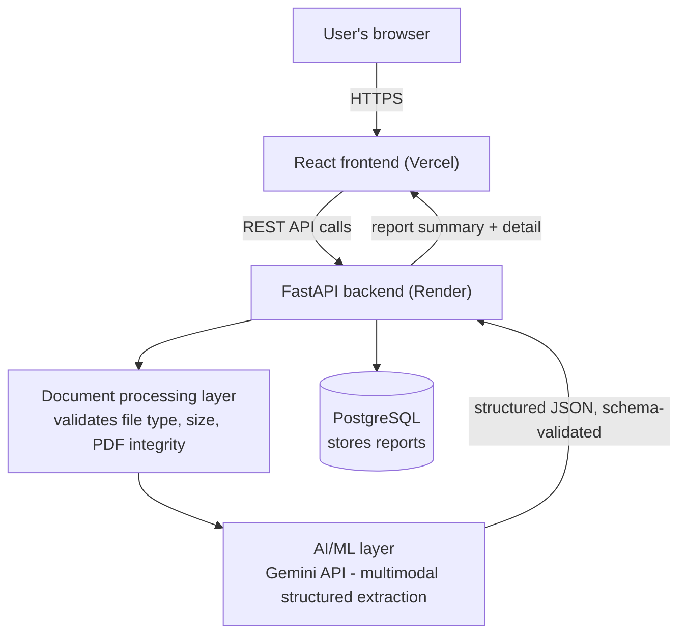

# Architecture

(GitHub renders Mermaid diagrams natively inside README/markdown files — no
extra tooling needed to view this.)

## Components

- **Frontend (React, on Vercel)** — collects text/image/PDF input, shows
  loading and error states, renders the structured report, and lists report
  history. Contains no AI logic; only talks to the backend's REST API.

- **Backend (FastAPI, on Render)** — the only component that talks to the
  AI/ML layer and the database. Exposes three endpoints:
  - `POST /api/analyze` — accepts text or a file, returns the completed (or
    failed) report
  - `GET /api/reports` — list of previous reports (id, status, summary,
    timestamp)
  - `GET /api/reports/{id}` — full detail for one report

- **Document processing layer** (`document_service.py`) — validates uploads
  (type, size, corruption, PDF page count) *before* anything is sent to the
  AI layer, so a bad upload is rejected quickly and cheaply with a clear
  message instead of burning an AI call on something that was never going
  to work.

- **AI/ML layer** (`ai_service.py`) — one Gemini API call per document. The
  document (raw text, or the original image/PDF bytes) is sent together
  with a system prompt and a JSON response schema. Gemini's native
  multimodal understanding reads the document directly — no separate OCR
  step — and returns JSON matching the `ClinicalReport` schema, which is
  then re-validated with Pydantic before it's trusted.

- **Database (PostgreSQL)** — one row per submission: status, summary, the
  full structured report (JSON column), a timestamp, and an error message
  if the analysis failed.

## Request flow

1. User submits text or uploads a file from the frontend.
2. If a file was uploaded, the document-processing layer validates it
   (type, size, whether the PDF actually opens, page count).
3. The backend creates a `pending` row in the database.
4. The backend calls the AI/ML layer with the raw text or file bytes.
5. Gemini returns schema-validated structured JSON (summary + all detailed
   fields) in a single call.
6. The backend updates the row to `completed` (or `failed`, with a
   human-readable message) and returns it to the frontend.
7. The frontend renders the summary and detailed sections, and the new
   report appears at the top of the history list.
